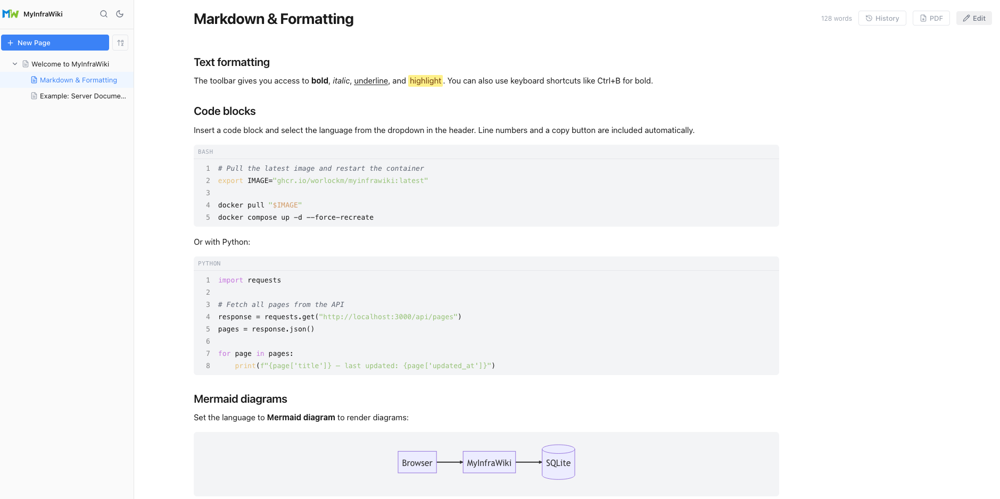
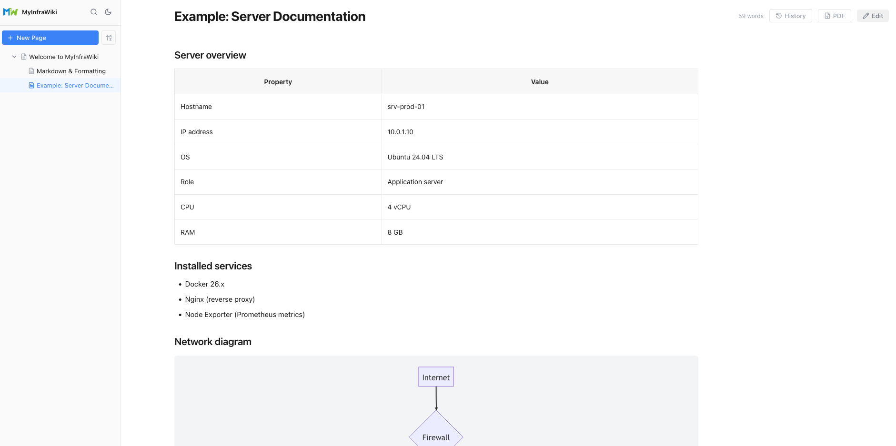

# MyInfraWiki

<p align="center">
  
</p>

**MyInfraWiki** is a self-hosted wiki application designed for documenting infrastructure. Built on [TipTap](https://tiptap.dev/), with a modern rich-text editor, dark mode support, and full hierarchical page structures.

---

## Features

- **Rich text editor** – formatting, headings, lists, tables, blockquotes, task lists and more
- **Code blocks** – syntax highlighting for 190+ languages, line numbers, copy button and language selector
- **Callout blocks** – info, warning and error styles
- **Hierarchical pages** – nest pages under other pages via drag-and-drop
- **Internal page links** – link directly to other wiki pages
- **Deep links** – every page has its own URL (`#/page/<id>`), so you can bookmark pages and link to them from runbooks, tickets or monitoring alerts; browser back/forward works too
- **Attachments** – attach files (PDF, configs, archives, and more) to a page via the paperclip button
- **Wiki export** – download the entire wiki as a zip of Markdown files (organised by page hierarchy, uploads included) via the download button in the sidebar
- **Table of Contents** – automatically generated from headings
- **Page tree** – display child pages of the current page
- **Images** – upload via drag-and-drop or paste from clipboard
- **Dark mode** – fully supported, defaults to system preference
- **Mobile-friendly** – responsive layout with slide-in sidebar, touch-optimised toolbar and scrollable tables
- **Full-text search** – fast SQLite FTS5 search across all page titles and content
- **Page history** – every save creates a version snapshot; restore any previous version with a word-level diff view
- **Backlinks** – see which pages link to the current page
- **Mermaid diagrams** – render flowcharts, sequence diagrams, pie charts and more inside code blocks

## Screenshots

<p align="center">
  <picture>
    <source media="(prefers-color-scheme: dark)" srcset="docs/screenshot-formatting-dark.png">
    
  </picture>
</p>
<p align="center">
  <picture>
    <source media="(prefers-color-scheme: dark)" srcset="docs/screenshot-server-docs-dark.png">
    
  </picture>
</p>

---

## Getting started

### With Docker Compose (recommended)

Create a `docker-compose.yml`:

```yaml
services:
  myinfrawiki:
    image: ghcr.io/worlockm/myinfrawiki:latest
    ports:
      - "3000:3000"
    volumes:
      - wiki-data:/data
    restart: unless-stopped

volumes:
  wiki-data:
```

Start the container:

```bash
docker compose up -d
```

MyInfraWiki is now available at [http://localhost:3000](http://localhost:3000).

---

### With Docker Run

```bash
docker run -d \
  --name myinfrawiki \
  -p 3000:3000 \
  -v wiki-data:/data \
  --restart unless-stopped \
  ghcr.io/worlockm/myinfrawiki:latest
```

---

## Authentication & security

MyInfraWiki has **no built-in authentication** — anyone who can reach the port can read and edit every page. Run it on a trusted network only, or put it behind something that handles authentication for you:

- a reverse proxy with authentication (e.g. Nginx with basic auth, Caddy, Authelia, or an OAuth proxy),
- a VPN or overlay network such as WireGuard or Tailscale,
- or at minimum a firewall rule restricting access to trusted hosts.

Uploaded files are served with `Content-Disposition: attachment` and `X-Content-Type-Options: nosniff`, so they download instead of executing in the browser. The app itself runs as the unprivileged `node` user: the entrypoint starts as root only to make `/data` writable for that user (including volumes created by older versions), then drops privileges. A liveness endpoint is available at `GET /api/health`.

> **Note:** if you override the container user with `user:` in your compose file, the entrypoint cannot fix ownership for you — make sure `/data` is writable by that user.

---

## Environment variables

All variables are optional. The defaults work out of the box with the example compose files above.

| Variable        | Default           | Description                              |
|-----------------|-------------------|------------------------------------------|
| `PORT`          | `3000`            | Port the server listens on               |
| `DATABASE_PATH` | `/data/wiki.db`   | Path to the SQLite database file         |
| `UPLOADS_PATH`  | `/data/uploads`   | Directory for uploaded images            |
| `NODE_ENV`      | `production`      | Environment (`production` / `development`) |

---

## Backup

All data is stored in the Docker volume `wiki-data`, mounted at `/data` inside the container:

| Path             | Contents                        |
|------------------|---------------------------------|
| `/data/wiki.db`  | Database with all pages         |
| `/data/uploads/` | Uploaded images                 |

**Create a backup (container does not need to be stopped):**

```bash
# Database
docker run --rm \
  -v wiki-data:/data \
  -v $(pwd):/backup \
  alpine cp /data/wiki.db /backup/wiki.db

# Uploads
docker run --rm \
  -v wiki-data:/data \
  -v $(pwd):/backup \
  alpine cp -r /data/uploads /backup/uploads
```

**Restore:**

```bash
docker run --rm \
  -v wiki-data:/data \
  -v $(pwd):/backup \
  alpine cp /backup/wiki.db /data/wiki.db

docker run --rm \
  -v wiki-data:/data \
  -v $(pwd):/backup \
  alpine cp -r /backup/uploads /data/uploads

docker compose restart myinfrawiki
```

---

## Tech stack

| Layer     | Technology                         |
|-----------|------------------------------------|
| Frontend  | React, TypeScript, TipTap v2       |
| Backend   | Node.js, Express, TypeScript       |
| Database  | SQLite (via `better-sqlite3`)      |
| Bundler   | Vite                               |
| Container | Docker (multi-stage build)         |
